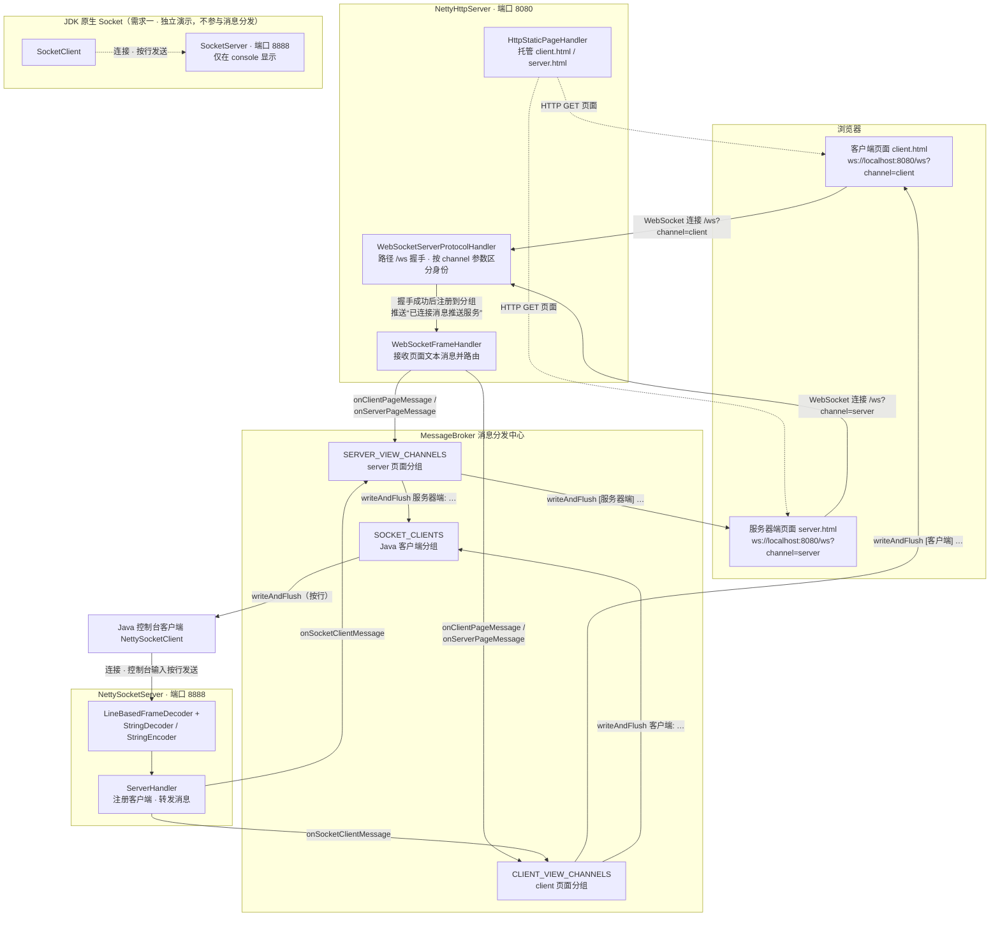
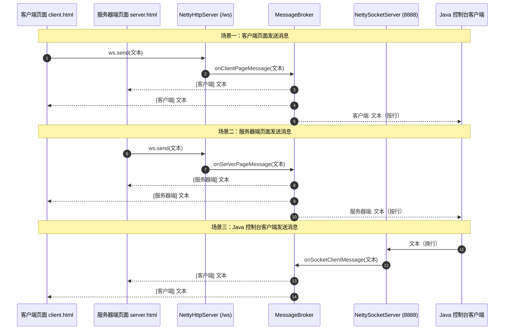

# 需求说明

本文档记录本项目（netty-study）开发过程中提出的所有需求及实现说明。

---

## 需求一：JDK Socket 服务器端与客户端

- **提出时间**：项目开发初期
- **需求描述**：添加基于 JDK 的 Socket 服务器端和客户端，实现客户端输出的内容在服务器端 console 显示。

### 实现说明

- 新增 `src/main/java/org/feiyu/socket/SocketServer.java`：JDK 原生 Socket 服务器端，监听 8888 端口，客户端连接、断开、收到消息均在 console 打印，每个连接一个线程处理。
- 新增 `src/main/java/org/feiyu/socket/SocketClient.java`：JDK 原生 Socket 客户端，从控制台读取输入发送到服务器，输入 `exit` 退出。
- 基于 `java.net.ServerSocket` / `java.net.Socket`，按行传输，UTF-8 编码。
- 运行方式：直接运行 `SocketServer` / `SocketClient` 的 main 方法。

---

## 需求二：Netty Socket 服务器端与客户端

- **提出时间**：完成需求一之后
- **需求描述**：添加基于 Netty 的 Socket 服务器端和客户端，实现客户端输出的内容在服务器端 console 显示。

### 实现说明

- 新增 `src/main/java/org/feiyu/netty/NettySocketServer.java`：Netty 服务器端，监听 8888 端口，客户端连接、断开、收到消息均在 console 打印。
- 新增 `src/main/java/org/feiyu/netty/NettySocketClient.java`：Netty 客户端，从控制台读取输入发送到服务器，输入 `exit` 退出。
- 协议：`LineBasedFrameDecoder + StringDecoder/StringEncoder`，按行传输，UTF-8 编码。
- `build.gradle` 添加 `io.netty:netty-all:4.1.115.Final` 依赖及 `runNettyServer` / `runNettyClient` 运行任务。

---

## 需求三：两个前端页面展示消息

- **提出时间**：完成需求二之后
- **需求描述**：添加两个前端页面，一个展示服务器端的消息，一个展示客户端的消息。

### 实现说明

- 新增 `src/main/resources/static/server.html`：服务器端消息页面，展示服务器收到的客户端消息。
- 新增 `src/main/resources/static/client.html`：客户端消息页面，展示客户端发送的消息。
- 新增 `src/main/java/org/feiyu/netty/NettyHttpServer.java`：Netty 内嵌 HTTP + WebSocket 服务（8080 端口），托管两个页面并通过 WebSocket 实时推送消息。
- 新增 `src/main/java/org/feiyu/netty/MessageBroker.java`：消息分发器，管理服务器端视图与客户端视图两个 WebSocket 订阅分组。
- 访问地址：`http://localhost:8080/server`、`http://localhost:8080/client`。

---

## 需求四：聊天室功能（双向输入发送）

- **提出时间**：完成需求三之后
- **需求描述**：客户端及服务器端都添加 textarea 输入框、textarea 消息显示框、发送按钮，点击发送时向对方发送消息，并将消息显示在消息显示框里面，类似聊天室的功能。

### 实现说明

- `server.html` / `client.html` 升级为聊天室界面：消息显示 textarea（只读）+ 输入 textarea + 发送按钮，支持点击发送或 Enter 快捷发送，带连接状态提示。
- 消息互通逻辑：
  - server 页面发送 → 推送两个页面显示（`[服务器端] xxx`），并转发给所有已连接的 Java 客户端。
  - client 页面发送 → 推送两个页面显示（`[客户端] xxx`），并转发给所有已连接的 Java 客户端。
  - Java 控制台客户端发送 → 推送两个页面显示（`[客户端] xxx`），服务器 console 同时打印。
- `MessageBroker.java` 重写为聊天消息路由：新增 Socket 客户端分组，支持页面 ↔ Java 客户端全互通。
- `NettyHttpServer.java`：`WebSocketFrameHandler` 接收页面发送的文本帧并按页面身份路由。
- `NettySocketServer.java`：Socket pipeline 增加 `StringEncoder` 用于向 Java 客户端写回消息；`ServerHandler` 注册 Socket 客户端并转发消息。

---

## 需求五：修复"连接未建立"问题

- **提出时间**：需求四完成后，页面发送消息时出现 Bug
- **问题现象**：浏览器打开 `/server`、`/client` 页面正常，但发送消息时弹出"连接未建立，请稍后再试"，WebSocket 连接一直处于 CONNECTING 状态，`onopen` 不触发。

### 根因分析

- 页面连接地址为 `ws://host/ws?channel=client`（带查询串），而 `NettyHttpServer` 中使用单参构造器 `new WebSocketServerProtocolHandler("/ws")`。
- Netty 4.1.115 中该单参构造器的 `checkStartsWith` 默认为 `false`，握手处理器 `WebSocketServerProtocolHandshakeHandler.isWebSocketPath` 对路径做**精确匹配**（`uri.equals(websocketPath)`）。
- `/ws?channel=client` 与 `/ws` 不相等，握手请求被判定为"非 WebSocket 路径"直接 `fireChannelRead` 放行到下游，没有任何 handler 处理，服务器不返回 101 升级响应。
- 浏览器连接一直挂起且 `onclose` 未触发，发送按钮保持可用，点击发送时 `readyState !== WebSocket.OPEN`，于是弹出"连接未建立"。

### 修复说明

- `NettyHttpServer.java`：改为 `new WebSocketServerProtocolHandler(WS_PATH, true)`，开启 `checkStartsWith`。
- 开启后握手路径校验变为 `startsWith("/ws")` 且下一个字符必须是 `/` 或 `?`（`checkNextUri` 校验），`/ws?channel=xxx` 可正常握手，`/wsabc` 这类路径不会误匹配。
- 无需修改前端页面。

---

## 需求六：项目架构与数据走向图

- **提出时间**：需求五修复完成之后
- **需求描述**：用图说明整个项目的架构组成与消息数据走向。

### 架构总览图



### 消息数据走向图（三种场景）



---

## 运行方式

```bash
gradlew.bat runNettyServer   # 启动服务器（8888 Socket 端口 + 8080 页面服务）
gradlew.bat runNettyClient   # 启动 Java 控制台客户端
```

浏览器访问：

- `http://localhost:8080/server`（服务器端消息页面）
- `http://localhost:8080/client`（客户端消息页面）